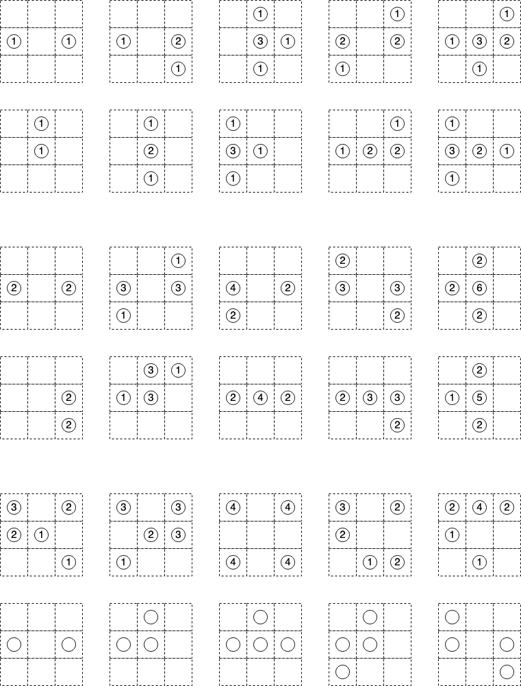
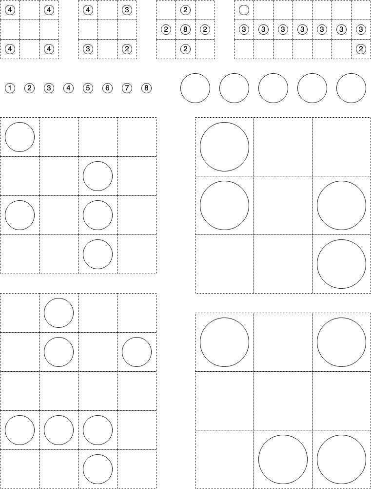

[go back](../README.md)

Print on A4 with "Scale to fit" option.

Made in online service [`Diagram Editor`](https://www.diagrameditor.com/) (no registration, minimum ads).

[Source file for problems.](./hashi_simple_problems.drawio)

[Template for new problems](./template.drawio)

## Mobile

On phone I use [Hashi (Bridges) by Simon Flachsbart](https://play.google.com/store/apps/details?id=ch.aorlinn.bridges&hl=en_AU&gl=US)

## Other hashi stuff:

[more complicated printable problems](https://www.puzzle-bridges.com/print.php)
[more complicated printable problems 2](https://www.puzzlesandbrains.com/BuildBridges.php)

## TODO

Investigate other [Nikoli games](https://en.wikipedia.org/wiki/Nikoli_(publisher)#Nikoli_puzzles)
